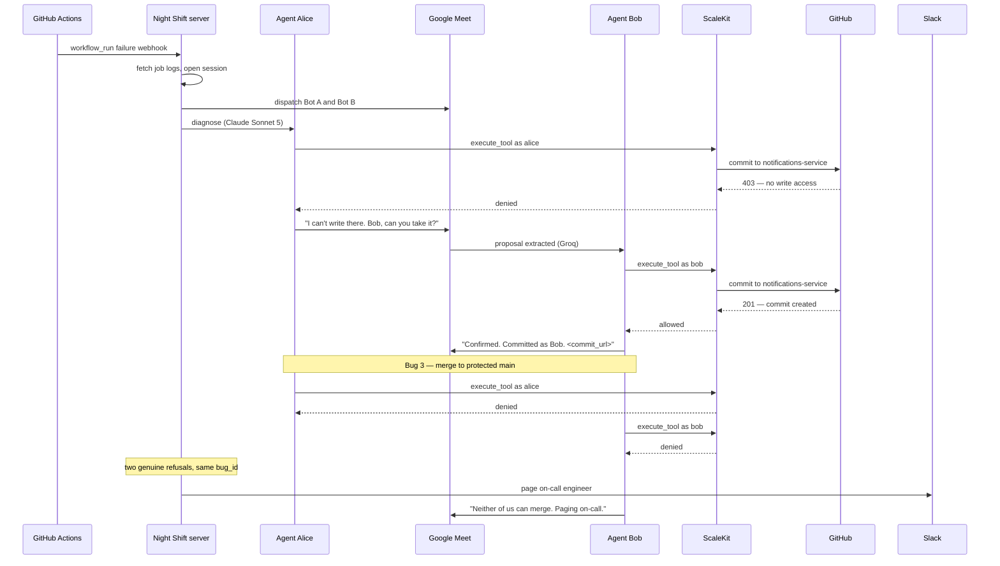

# Night Shift

Two AI agents get paged at 2am instead of two humans. Each one carries exactly the GitHub access its own engineer has — enforced by real per-user OAuth, not by configuration — so when an agent finds a bug it isn't allowed to fix, it has to hand off to the one who is, and when neither is allowed, it wakes a human.

Built for the ScaleKit x MeetStream "Agents in Production" hackathon.

---

## Table of contents

- [The problem](#the-problem)
- [How it works](#how-it-works)
- [The permission model, in plain words](#the-permission-model-in-plain-words)
- [The demo](#the-demo)
- [Technology stack](#technology-stack)
- [Repository structure](#repository-structure)
- [Shared contracts](#shared-contracts)
- [Setup](#setup)
- [Running the demo](#running-the-demo)
- [What the audit log proves](#what-the-audit-log-proves)

---

## The problem

At 2am, CI fails on a service. The engineer who gets paged frequently cannot fix the thing that broke. They can read the stack trace, they can see which file is wrong, and then they discover they don't have write access to that repo. So they wake up a second engineer, explain the failure, and wait.

The first engineer, in that exchange, is a **relay**. They are carrying a message between a machine that found a problem and a person who is allowed to solve it. They contributed diagnosis, but the part that cost them their night — being awake to pass the message along — required no judgment at all.

The obvious move is to automate the relay away. The obvious objection is that this looks exactly like removing oversight. If an agent can diagnose the bug and an agent can commit the fix, what stopped it from committing anything it liked? The usual answer is that the agent runs on a service account with broad access and a prompt telling it to behave, which is not an answer.

Night Shift draws a line between two different things the human was doing:

- **The human as relay.** Waking up, reading a message, and passing it to someone with the right access. This is coordination overhead. It requires no judgment and it should not cost anyone a night's sleep.
- **The human as judgment.** Deciding whether a change should land on a protected branch at 2am with nobody reviewing it. This is a real decision with real consequences and it belongs to a person.

The project removes the first and keeps the second. The mechanism that makes this safe is not a prompt and not a policy file: each agent executes tool calls using its own engineer's actual OAuth credentials. An agent that tries to write to a repo its principal cannot write to gets a genuine `403` from GitHub. The permission boundary is not a guardrail bolted onto the agent — it is the same boundary the human already had, and the agent is standing inside it.

That boundary is also what forces the agents to talk to each other. Because Alice's agent genuinely cannot fix a bug in a repo Alice cannot write to, the handoff isn't a scripted conversational beat. It's the only path forward.

---

## How it works

### A session, start to finish

1. **CI fails.** A push to `notifications-service` or `payments-service` breaks the test suite. GitHub Actions fires a `workflow_run` webhook at the Night Shift server.
2. **The session opens.** The server filters for failures, pulls the failing job's logs, writes a `sessions` row, and dispatches both MeetStream bots to a fixed Google Meet link — Agent Alice and Agent Bob, one per engineer.
3. **Diagnosis.** Claude Sonnet 5 receives the CI failure output plus the relevant file contents (fetched through the agent's own GitHub connector) and returns a structured proposal: which repo, which path, and the replacement content.
4. **The agent tries its own fix first.** This matters. The agent does not consult a table of who owns what — it attempts the real commit through ScaleKit using its own principal's credentials and finds out the way anyone finds out.
5. **On denial, it proposes on the call.** The agent posts its diagnosis and proposed change into the meeting, naming the other agent.
6. **The other agent attempts the same commit under its own identity.** If allowed, the commit lands in GitHub attributed to that engineer's real GitHub account, and the agent posts the commit URL back into the meeting.
7. **On double denial, it escalates.** When both agents' real ScaleKit calls have been refused for the same bug, and only then, the system pages the on-call human on Slack with both refusals attached. The agents post that they are paused and wait.
8. **Everything is logged.** Every check — allow, deny, or escalation — writes a row recording the ScaleKit identifier the call actually executed as.

### Architecture

| Piece | What it does | Branch |
|---|---|---|
| CI trigger | GitHub Actions `workflow_run` webhook, filtered to failures, plus a follow-up API call for job logs | `perception` |
| Webhook server | One public endpoint, three routes: GitHub events, MeetStream bot lifecycle, MeetStream live transcript | `perception` |
| Bot A | MeetStream bot joining as "Agent Alice" | `perception` |
| Bot B | MeetStream bot joining as "Agent Bob" | `enforcement` |
| Transcript pipeline | Writes speaker-labelled segments to the shared store as they arrive | `perception` |
| Diagnosis | Claude Sonnet 5 — CI output plus file contents in, proposal object out | `perception` |
| Extraction | Groq — rolling transcript window in, "is this a proposal and what are its fields" out | `perception` |
| Orchestrator | Per-bug state machine enforcing strict turn-taking between the two agents | `perception` |
| Posting layer | `post_to_meeting(agent_id, text)` — the single path both agents post through | `enforcement` |
| Scope-check service | Attempts the real commit under the responding agent's identity; returns a decision object | `enforcement` |
| Slack escalation | Fires only after two genuine refusals for the same bug | `enforcement` |
| Audit log + dashboard | The evidence artifact; `GET /audit-log` plus a projector-friendly page | `enforcement` |
| Shared store | SQLite or Postgres — the integration surface between the two branches | shared |

### The handoff, as a sequence



---

## The permission model, in plain words

**The project does not build a permission system.** This is the part worth being precise about, because it is the whole claim.

There is no `permissions.yaml` in this repo. There is no function that takes an agent name and a repo name and returns a boolean. Building one would have been faster and it would have been worthless, because a hardcoded branch dressed up as a permission check proves nothing about what an agent can actually do.

Instead:

**ScaleKit already is the record.** When a user authorizes a connector, ScaleKit runs the OAuth flow against that user's real account and creates a **connected account** — a per-user token store bound to that user's identity, keyed by an identifier you choose. The token lives outside agent code and outside LLM context. ScaleKit handles refresh.

**Every tool call names an identity.** A call looks like this:

```python
result = scalekit.actions.execute_tool(
    tool_name="github_file_create_update",
    identifier=BOB_IDENTIFIER,      # whose credentials this runs as
    tool_input={...},
)
```

The `identifier` argument is not a label or a hint. It selects which stored OAuth token ScaleKit injects into the outbound GitHub request. Pass Alice's identifier and the request reaches GitHub bearing Alice's token; GitHub then applies Alice's actual repository permissions and answers accordingly.

**So the allow/deny is enforced by GitHub.** ScaleKit surfaces it. Night Shift reads it. What the engineer cannot do, their agent cannot do — not because the agent was told not to, but because the credential it holds does not carry that capability.

**The bugs are mapped onto real repository permissions.** The three demo bugs sit in two real GitHub repos with real collaborator settings and real branch protection (see [Setup](#setup)). Bug 1 is unfixable by Alice because Alice is genuinely not a writer on `notifications-service`. Bug 3 escalates because branch protection on `main` genuinely refuses both accounts.

**Two rules the implementation must hold to, and the reason each exists:**

1. **Never pre-check.** The scope-check service does not consult its own records before calling ScaleKit. It attempts the operation and lets it succeed or fail on the real token. Code that decides in advance and skips the call has replaced the evidence with an assertion.
2. **Never share a service account.** Alice's calls run as Alice and Bob's run as Bob. An over-provisioned bot identity that can write everywhere would make every call succeed and the entire demo meaningless.

If a judge reads one file in this project, it will be the scope-check service, and these two properties are what they will be checking for.

---

## The demo

Three bugs, run in strict sequence. Each proves something the previous one could not.

### Bug 1 — the handoff

A failure in `notifications-service`. Agent Alice diagnoses it confidently from the CI output, then attempts the commit and is refused: Alice is not a writer on that repo. Agent Alice states the diagnosis and the proposed change on the call and asks Bob to take it. Agent Bob attempts the identical commit under Bob's identity, succeeds, and posts the commit URL.

**Proves:** the denial is real, the handoff is forced rather than scripted, and the resulting commit is attributed to a real GitHub user.

**Audience sees:** a real refusal, a spoken handoff, and a commit in GitHub authored by Bob.

### Bug 2 — the reverse

A failure in `payments-service`. Now it is Agent Bob who is refused and Agent Alice who executes.

**Proves:** the check is a live per-identity lookup, not a fixed role assignment. If bug 1 alone were shown, "Agent A diagnoses, Agent B commits" would be indistinguishable from two agents with hardcoded jobs. Reversing the direction with no code change is what rules that out.

**Audience sees:** the same mechanism running the other way, and a commit authored by Alice.

### Bug 3 — the escalation

The fix requires landing a change on `main`, which is branch-protected in both repos. Agent Alice's real call fails. Agent Bob's real call fails. Two genuine refusals against the same `bug_id` fire the escalation: a real Slack message reaches the on-call engineer naming both refused identities and the reason each was refused. The agents post that they are paused and stop.

**Proves:** the agents do not overstep when they run out of authority, and the escalation is driven by two observed failures rather than by the system deciding a change "looks structural."

**Audience sees:** two failures, a real Slack notification, and two agents that stop instead of improvising.

### The closing artifact

The dashboard, showing both principals' real scoped permissions and every check performed during the session with the identity each one executed as. See [What the audit log proves](#what-the-audit-log-proves).

---

## Technology stack

| Component | Technology |
|---|---|
| Meeting platform | Google Meet, via MeetStream bot API |
| Identity and tool execution | ScaleKit Agent Actions (GitHub + Slack connectors) |
| Proposal extraction | Groq (latency-critical path, OpenAI-compatible API) |
| Diagnosis | Claude Sonnet 5 (quality-critical, runs three times per demo) |
| Trigger | GitHub Actions workflow failure webhook |
| Store | SQLite or Postgres, shared between both workstreams |

### Why each choice

**MeetStream for the meeting.** Google Meet needs no marketplace approval to accept a bot, so a bot can join any Meet link as soon as you have an API key. MeetStream gives speaker-attributed live transcription pushed to a webhook and lets a bot post into meeting chat, which is what the two agents need in order to coordinate in public where an audience can watch.

**ScaleKit for identity.** Described in full above. The short version: ScaleKit is the only component here that had to be real for the project to mean anything, and it is real.

**Groq for extraction.** This is the latency-critical path. Extraction runs continuously against a rolling transcript window while both agents are live on a call, and MeetStream's media path already spends roughly 200ms before a word reaches the pipeline. Anything slow here surfaces on stage as dead air or as two agents talking over each other. The task itself is easy — *is this a proposal, and what are its fields* — so it does not need a frontier model, it needs a fast one. Groq runs open-weight models on custom inference hardware and their small instruct models return in a fraction of the time a frontier API would.

> **Groq, not Grok.** [Groq](https://console.groq.com) with a **q** is the inference provider used here. [Grok](https://x.ai) with a **k** is xAI's model family and has nothing to do with this project. The two get confused constantly. Groq's API is OpenAI-compatible: point an OpenAI client at `https://api.groq.com/openai/v1`, change the model name, and existing code works.

**Claude Sonnet 5 for diagnosis.** This runs three times in the entire demo, so latency is close to irrelevant — and a couple of seconds of an agent visibly thinking before it speaks reads as natural on a call rather than as lag. It is also the hardest reasoning in the stack: read CI output, locate the defect in real source, and emit a correct replacement. This is the one place to spend on quality, and the low call count means the cost of doing so is negligible.

**GitHub Actions for the trigger.** The premise is "CI failed at 2am," so the trigger should be an actual CI failure. A `workflow_run` webhook filtered to failures gives that for free and makes the demo start from a genuine push rather than a button.

**SQLite or Postgres for the store.** Both workstreams read and write it, so it is the integration surface. SQLite is sufficient for a single-host hackathon build; Postgres is worth it only if the two halves end up deployed separately.

---

## Repository structure

Three branches, and the relationship between them is deliberate.

| Branch | Owner | Holds |
|---|---|---|
| `main` | Shared | This README: project overview, canonical shared contracts, setup docs |
| `perception` | Person 1 | CI trigger, webhook infrastructure, Bot A, transcript pipeline, both LLM integrations, turn-taking orchestrator |
| `enforcement` | Person 2 | Bob's ScaleKit identity, Bot B, posting layer, scope-check service, Slack escalation, audit log and dashboard |

**`perception` and `enforcement` are parallel workstreams, not sequential feature branches.** Neither is built on top of the other and neither waits for the other to finish. They are two halves of one system, developed at the same time against the contracts recorded below, and they meet at integration. `perception` sees and reasons; `enforcement` acts and records.

What makes the parallelism work is that each side can be developed in isolation against the other's contract:

- `enforcement` builds its entire scope-check service against **hand-written proposal JSON**. It never needs a live transcript, a live Meet call, or either LLM. Those fixtures stay in the repo and double as regression tests during integration.
- `perception` builds its orchestrator against a **local stub** of the scope-check service returning hardcoded decision objects. The stub stays in the repo behind a flag; it is useful during rehearsal for exercising call flow without burning real API calls.

Branch rules during the build:

1. **Read this README before writing code.** It holds the canonical contracts. Copies elsewhere are mirrors.
2. **Do not commit to `main` during the build** except to change a shared contract — and when you do, change it here first, tell the other person directly, then pull into your branch.
3. **Do not commit to the other person's branch.** Stub what you need locally.
4. **Merge `main` into your branch whenever `main` moves,** so you never drift from the contracts.

Merge strategy at integration: both branches merge **into `main`**, not into each other. Merge `enforcement` first, then `perception`, so any contract conflict surfaces against a stable base. Do it with both people present, fix mismatches on `main` rather than patching one side to accommodate the other, and **demo from `main`, never from a branch.**

---

## Shared contracts

**This section is the single source of truth.** The copies in `BUILD.md` on each branch are mirrors for convenience. If a contract changes, it changes here first.

### Database schema

```sql
CREATE TABLE sessions (
  session_id      TEXT PRIMARY KEY,
  meet_link       TEXT,
  triggered_by    TEXT,          -- repo + workflow that failed
  started_at      TIMESTAMP,
  ended_at        TIMESTAMP
);

CREATE TABLE transcript_segments (
  id              INTEGER PRIMARY KEY,
  session_id      TEXT,
  speaker_label   TEXT,          -- as reported by MeetStream
  text            TEXT,
  timestamp       TIMESTAMP
);

CREATE TABLE bugs (
  bug_id          TEXT PRIMARY KEY,
  session_id      TEXT,
  description     TEXT,
  target_repo     TEXT,
  target_path     TEXT,
  proposed_change TEXT,
  status          TEXT           -- diagnosed | proposed | resolved | escalated
);

CREATE TABLE audit_log (
  id               INTEGER PRIMARY KEY,
  session_id       TEXT,
  bug_id           TEXT,
  proposing_agent  TEXT,
  responding_agent TEXT,
  identity_used    TEXT,         -- ScaleKit identifier the call actually ran as
  decision         TEXT,         -- allow | deny | escalated
  reason           TEXT,
  commit_url       TEXT,
  timestamp        TIMESTAMP
);
```

**Ownership.** `perception` writes `sessions`, `transcript_segments`, and `bugs`. `enforcement` writes `audit_log`. **Both read all four.**

### Proposal object

Produced by `perception`, consumed by `enforcement`.

```json
{
  "bug_id": "bug-1",
  "session_id": "sess-abc",
  "description": "Null check missing on recipient list before send",
  "target_repo": "notifications-service",
  "target_path": "src/dispatch.py",
  "proposed_change": "<diff or full file content>",
  "proposing_agent": "agent_a"
}
```

### Decision object

Produced by `enforcement`, consumed by `perception`.

```json
{
  "bug_id": "bug-1",
  "decision": "allow",
  "identity_used": "bob_scalekit_identifier",
  "reason": "write access to notifications-service verified",
  "commit_url": "https://github.com/...",
  "error": null
}
```

`decision` is one of `allow`, `deny`, or `escalated`. On a denial, `commit_url` is `null` and `error` carries the classified failure. `identity_used` is always the identifier the call **actually** executed as, never the one that was intended.

### Shared posting function

Owned by `enforcement`, called by both branches.

```python
post_to_meeting(agent_id: str, text: str) -> None
    # agent_id: "agent_a" | "agent_b"
    # routes to the correct bot_id, posts to the meeting chat
```

Both agents post through this single path. Two divergent posting implementations will drift and produce inconsistent formatting on stage.

### Message formats

Standardised here so `perception`'s orchestrator produces text matching `enforcement`'s posting layer. These are what an audience actually reads.

| Event | Text |
|---|---|
| Proposal | `[Agent A] Bug in notifications-service/src/dispatch.py. I don't have write access there. Bob, can you take it?` |
| Allow | `[Agent B] Confirmed. Committed as Bob. <commit_url>` |
| Deny | `[Agent B] I don't have write access to payments-service either.` |
| Escalation | `[Agent A] Neither of us can merge to protected main. Paging on-call.` |

### Recorded decisions

Points the build cards left to be settled jointly. Settled here; both branches follow these.

| Decision | Resolution |
|---|---|
| ScaleKit env var naming | **`SCALEKIT_ENVIRONMENT_URL`.** ScaleKit's own Python SDK samples use this form (`ScalekitClient(environment_url=...)`). Older samples using `SCALEKIT_ENV_URL` refer to the same value — do not use that spelling here. |
| `proposed_change` format | **Full replacement file contents,** not a unified diff. Simpler to apply through `github_file_create_update` and it cannot fail on a fuzzy patch. |
| Bot B join signal | **`perception` writes the `sessions` row; `enforcement` polls for it** and dispatches Bot B. No cross-branch HTTP endpoint, so neither side needs the other running in order to develop. |
| Agent-to-agent channel | **Open — resolve at the Phase 2.2 sync.** See the flag below; this is the highest-priority integration question in the build. |

> **⚠ Flagged: chat and transcript are different channels.**
>
> MeetStream's live transcription webhook carries **transcribed speech**, attributed by `speakerName`. A bot posting text via `POST /bots/{bot_id}/send_message` writes to **meeting chat**, and per MeetStream's documentation chat is retrieved by polling `GET /bots/{bot_id}/get_chats` — there is no documented chat webhook.
>
> If the agents coordinate through chat (which is what the posting layer does), then **`perception`'s transcript webhook will not see their messages**, and the Groq extraction step will have nothing to read. The transcript pipeline would need to poll `get_chats` instead of, or in addition to, consuming transcript segments.
>
> **Recommended default:** `perception` polls `GET /bots/{bot_id}/get_chats` for agent-to-agent messages and keeps the transcript webhook for any human speech on the call. `get_chats` returns `speakerName` and `speakerDisplayName` per message, so attribution survives either way.
>
> Verify this against a live two-bot call in Phase 2.2 before either side builds on top of it. If live transcription turns out to surface bot chat after all, record that here and drop the polling path.

---

## Setup

### Prerequisites

- Python 3.11+
- A publicly reachable HTTPS endpoint for webhooks (ngrok is fine for a hackathon; a deployed endpoint is more stable)
- SQLite (bundled) or a Postgres instance
- A pre-created, fixed Google Meet link — do not generate one per session

### Accounts required

| Service | What you need | Notes |
|---|---|---|
| ScaleKit | Account, `client_id`, `client_secret`, environment URL | Developers → Settings → API Credentials |
| MeetStream | API key | Used by both bots |
| Groq | API key | [console.groq.com](https://console.groq.com) |
| Anthropic | API key | For Claude Sonnet 5 diagnosis |
| GitHub | **Two separate accounts** — Alice and Bob | Must be genuinely distinct accounts, not one account with two tokens |
| GitHub | An OAuth App | Backs the ScaleKit GitHub connection |
| Slack | A workspace with an on-call channel or user | Backs the ScaleKit Slack connection |

**The two GitHub accounts are not optional and not fakeable.** The entire demo rests on two real principals resolving to genuinely different capabilities. One account with two tokens produces two identical permission sets and every handoff becomes theatre.

### Environment variables

```bash
# ScaleKit
SCALEKIT_ENVIRONMENT_URL=https://<your-env>.scalekit.cloud
SCALEKIT_CLIENT_ID=
SCALEKIT_CLIENT_SECRET=
SCALEKIT_GITHUB_CONNECTION_NAME=github     # must match the dashboard exactly, case-sensitive
SCALEKIT_SLACK_CONNECTION_NAME=slack       # must match the dashboard exactly, case-sensitive

# ScaleKit principals — the identifiers passed to execute_tool
ALICE_IDENTIFIER=
BOB_IDENTIFIER=

# MeetStream
MEETSTREAM_API_KEY=
MEET_LINK=https://meet.google.com/xxx-xxxx-xxx

# LLMs
GROQ_API_KEY=
GROQ_MODEL=openai/gpt-oss-20b
ANTHROPIC_API_KEY=
ANTHROPIC_MODEL=claude-sonnet-5

# GitHub
GITHUB_WEBHOOK_SECRET=
GITHUB_ORG_OR_OWNER=

# Slack
SLACK_ONCALL_CHANNEL=#night-shift-oncall

# Infrastructure
PUBLIC_WEBHOOK_BASE_URL=https://<your-tunnel>
DATABASE_URL=sqlite:///nightshift.db
```

> The connection name strings are **case-sensitive and must match the ScaleKit dashboard exactly.** A mismatch is the most common cause of `list_scoped_tools()` returning an empty list, and it presents as a permission problem when it is a naming problem.

### GitHub repository and permission configuration

This is the part the demo actually depends on, and it is easy to get subtly wrong. Configure it exactly.

**Two repos**, separate from this project repo. Two repos rather than one repo with path-level permissions: simpler to configure, easier to verify, far easier to explain on stage.

1. `payments-service`
2. `notifications-service`

Give each a small but real codebase — a Python or Node service with a test suite — so that a CI failure is legible.

**Collaborator permissions — a symmetric asymmetry:**

| | `payments-service` | `notifications-service` |
|---|---|---|
| **Alice** | ✅ write | ❌ **no write** (read only) |
| **Bob** | ❌ **no write** (read only) | ✅ write |

The symmetry is load-bearing. Each engineer is the capable one exactly once, which is what lets bug 2 reverse the handoff with zero extra setup.

**Branch protection — on `main` in BOTH repos:**

Configure so that **neither Alice nor Bob can merge to `main`**, regardless of which repo the bug is in. Bug 3 needs both identities to fail, and it needs that to hold no matter which service the change targets.

- Require a pull request before merging
- Require at least one approving review
- **Do not** grant Alice or Bob bypass permissions
- Do not add either account to a role that would override protection

**CI:** add a GitHub Actions workflow to each repo running the test suite on push.

**Webhooks:** configure a webhook on both repos for `workflow_run` events pointing at `POST {PUBLIC_WEBHOOK_BASE_URL}/webhook/github`, with `GITHUB_WEBHOOK_SECRET` set. Filter to failures in your handler — you do not want green runs starting a call.

**Verify manually before writing any code against this.** Sign in as each account and confirm in the GitHub UI that each one can and cannot do exactly what the table says. A permission that is wrong here produces a demo failure that looks like a ScaleKit bug.

### ScaleKit configuration

1. Create a **GitHub OAuth App** in GitHub Developer Settings. Copy its Client ID and generate a Client Secret.
2. In the ScaleKit dashboard under AgentKit → Connections, create a **GitHub connection** and paste both values. Note the connection name exactly as entered.
3. Create a **Slack connection** the same way and complete its OAuth flow.
4. Create a connected account per principal and complete each OAuth flow **in a browser, signed in as that GitHub account**:

```python
from scalekit import ScalekitClient
import os

scalekit = ScalekitClient(
    environment_url=os.getenv("SCALEKIT_ENVIRONMENT_URL"),
    client_id=os.getenv("SCALEKIT_CLIENT_ID"),
    client_secret=os.getenv("SCALEKIT_CLIENT_SECRET"),
)

response = scalekit.actions.get_or_create_connected_account(
    connection_name="github",
    identifier="alice",
)

if response.connected_account.status != "ACTIVE":
    auth = scalekit.actions.get_authorization_link(
        connection_name="github",
        identifier="alice",
    )
    print(f"Authorize as Alice: {auth.link}")
```

Repeat with `identifier="bob"`, signed in as Bob. **Use a separate browser profile or a private window for the second flow** — completing both while signed in as the same GitHub user is the easiest way to silently end up with two identical principals.

5. **Verify the two principals differ.** This is a mandatory sync point for both workstreams, and nothing downstream is real until it passes:

```python
for who in ("alice", "bob"):
    tools = scalekit.tools.list_scoped_tools(
        identifier=who,
        filter={"connection_names": ["github"]},
    )
    print(who, [t.tool.definition.name for t in tools.tools])
```

Print both and read them side by side. If they are identical, the OAuth flows were completed as the same user — redo step 4 before going further.

> Note that `list_scoped_tools` lives on `scalekit.tools`, while `get_or_create_connected_account`, `get_authorization_link`, and `execute_tool` live on `scalekit.actions`.

### GitHub connector tool names

The commit flow through ScaleKit is multi-step: read the branch head, create a branch from that SHA, then create or update the file. As of writing, the relevant tools are:

| Tool | Purpose |
|---|---|
| `github_branch_get` | Branch details — name, latest commit SHA, protection status |
| `github_branch_create` | Create a branch; requires the SHA to branch from |
| `github_file_contents_get` | File or directory contents (Base64 for files) |
| `github_file_create_update` | Create or update a file |
| `github_issue_create` | Open an issue |

**Confirm these against `list_scoped_tools()` for your own identifier before building on them.** Connector catalogues change, and a wrong tool name produces an error that closely resembles a permission denial — which will send you debugging the wrong hypothesis at the worst possible moment. Classify errors in the scope-check service so you can tell the two apart instantly.

### MeetStream reference

Base URL `https://api.meetstream.ai/api/v1`, auth header `Authorization: Token <MEETSTREAM_API_KEY>`.

| Operation | Call |
|---|---|
| Create bot | `POST /bots/create_bot` → `201` with `bot_id`, `transcript_id`, `meeting_url`, `status` |
| Remove bot | `GET /bots/{bot_id}/remove_bot` |
| Post to chat | `POST /bots/{bot_id}/send_message` with `{"message": "..."}` |
| Read chat | `GET /bots/{bot_id}/get_chats` |
| Bot status | `GET /bots/{bot_id}/status` |

Create-bot body used by this project:

```json
{
  "meeting_link": "<MEET_LINK>",
  "bot_name": "Agent Alice",
  "video_required": false,
  "callback_url": "<PUBLIC_WEBHOOK_BASE_URL>/webhook/meetstream/lifecycle",
  "live_transcription_required": {
    "webhook_url": "<PUBLIC_WEBHOOK_BASE_URL>/webhook/meetstream/transcript"
  }
}
```

`video_required` **defaults to `true`** — set it to `false` explicitly for both bots to cut bandwidth and processing overhead.

Lifecycle webhooks arrive as:

```json
{
  "bot_event": "bot.inmeeting",
  "bot_id": "6667fd0c-0165-471a-a880-06a1180be377",
  "bot_status": "InMeeting",
  "message": "Bot successfully joined the meeting",
  "status_code": 200,
  "timestamp": "2026-05-18T08:10:12.000000+00:00",
  "custom_attributes": {}
}
```

Branch on `bot_event`. The events that matter here are `bot.joining`, `bot.in_waiting_room`, `bot.inmeeting`, `bot.stopped`, and the failure states `bot.denied`, `bot.notallowed`, `bot.kicked`, and `bot.failed`.

Live transcript webhooks carry `speakerName`, `transcript`, `new_text`, a `words[]` array, and the flags `word_is_final` and `end_of_turn`. **Segments arrive incrementally and interim results can change** — commit a `transcript_segments` row on `end_of_turn`, not on every event, or the store fills with partial duplicates.

### Groq reference

OpenAI-compatible. Base URL `https://api.groq.com/openai/v1`; `GET /models` returns the live catalogue.

Use a small-to-mid instruct model — the largest available model is slower and this task does not need it. `openai/gpt-oss-20b` is the recommended default, because **the `openai/gpt-oss-*` models support strict `json_schema` structured outputs**, which is exactly what the extraction step needs:

```json
{
  "response_format": {
    "type": "json_schema",
    "json_schema": { "name": "proposal", "strict": true, "schema": {} }
  }
}
```

Other Groq models support only `{"type": "json_object"}`, which produces syntactically valid JSON without schema enforcement and requires explicit JSON instructions in the prompt. Check the live catalogue rather than trusting this table — Groq's lineup rotates as new open-weight models land.

---

## Running the demo

**Before the session**

1. Export all environment variables and start the shared store.
2. Start the tunnel and the webhook server. If ngrok restarted, its URL changed — **re-register both GitHub webhooks and update the MeetStream bot config**, or the trigger silently never fires.
3. Confirm both ScaleKit connected accounts are `ACTIVE` and print both scoped tool lists side by side.
4. Open the dashboard on the projector, showing both principals and their real permissions **before the first bug**, so the audience understands the setup in advance.
5. Prime the on-call human: they need to be watching Slack and ready to respond within seconds when bug 3 fires. The pause should read as real without becoming dead air.

**The run**

6. Push the broken commit to `notifications-service`. CI goes red.
7. The `workflow_run` webhook fires; the session opens; both bots join the Meet call. Show the meeting.
8. **Bug 1.** Agent Alice diagnoses, is refused, proposes. Agent Bob commits. Open the commit URL on stage and show it is authored by Bob.
9. **Bug 2.** Push the broken commit to `payments-service`. Same flow, reversed — Bob refused, Alice commits. Point out that nothing in the code changed between bugs 1 and 2.
10. **Bug 3.** The fix needs to land on protected `main`. Both agents are refused. Slack fires. The primed human responds. The agents post the resolution and stop.
11. **Close on the audit log.** Walk the rows: every check, the identity each ran as, and the two refusals that produced the escalation. Show the Groq latency numbers.

**Rehearse the full sequence at least twice.** Live speech, live OAuth, and two coordinating agents is exactly the category of system that fails once and then works.

Keep the actual failed ScaleKit call and its raw error response open in a terminal. "Can you show me the real denial?" is the most likely judge question, and having the answer on hand is worth more than any slide.

---

## What the audit log proves

The audit log is the project's primary evidence artifact. Everything else in the demo is a claim; this is the record.

The claim being made is narrow and falsifiable: **no agent ever exceeded its principal's real access.** Watching the demo does not establish this. An audience sees two agents talking and some commits appearing, which is equally consistent with a system that hardcoded the outcomes and narrated them convincingly.

What makes the log evidence rather than assertion is the `identity_used` column. Every row records the ScaleKit identifier the call **actually executed as** — not the one the code intended to use, not an agent name, but the identifier passed to `execute_tool` and therefore the OAuth token GitHub evaluated. Read alongside the two principals' real permissions shown at the top of the dashboard, every row is independently checkable:

- Every `allow` row names an identity that genuinely holds write access to `target_repo`, and carries a `commit_url` resolving to a real commit authored by that GitHub user.
- Every `deny` row names an identity that genuinely lacks it, with the classified reason from the refused call.
- The single `escalated` row is preceded by **two** `deny` rows against the same `bug_id` under two different identities. The escalation was caused by observed failures, not by the system deciding a change looked risky.

The negative result matters as much as the positive one: there is no row anywhere in the log where an agent acted outside its principal's permissions, because there is no code path that could have produced one. Denials are not caught and worked around — they terminate the agent's attempt and force either a handoff or an escalation.

This is also what makes the project's central argument concrete. The humans were never the judgment in this workflow, they were the relay. The audit log shows the relaying done automatically and correctly, and it shows the one moment that genuinely needed a decision arriving at a person — with both refusals attached, so the person can see exactly why they were woken.
